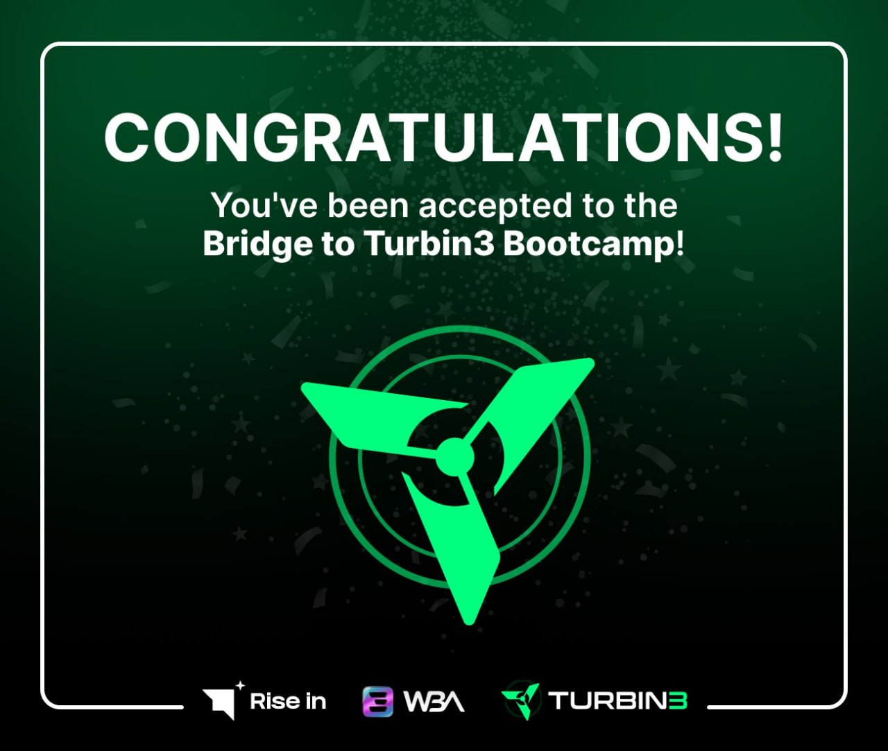

# Bridge to Turbin3

**Success! Check out your TX here:**
[View Transaction](https://explorer.solana.com/tx/5LMSV2N4KQ6VbjZDw9j4gWwRuq4ReXW6yL7n7PdSgaaZdiWmKT8LWTjCehveL1aZpF32LsHu8oij1RjWSZbYNLVF?cluster=devnet)

Welcome to the **Bridge to Turbin3** bootcamp, your gateway to becoming a proficient web3 developer on the Solana blockchain. This course is designed to equip you with the foundational knowledge and practical skills needed to navigate the evolving landscape of decentralized applications (dApps).

## Course Overview

### **Introduction to TypeScript**

- Basics of TypeScript programming language.
- Understanding variables, data types, functions, and arrow functions.
- Exploring type inference, type assertions, advanced types, and interfaces.

### **Web3 Fundamentals**

- Journey through Web1, Web2, and the emergence of Web3.
- Introduction to the architecture of decentralized applications (dApps).

### **Solana's Architecture and Ecosystem**

- Deep dive into Solana's architecture, transactions, and account model.
- Hands-on experience with setting up the Solana development environment, creating keypairs, and claiming token airdrops.

### **Introduction to Rust**

- Fundamentals of Rust programming language.
- Concepts of ownership, basic data types, functions, and control flow.
- Introduction to the Anchor framework and building a "Hello World" program on Solana.

### **Interacting with Solana Programs and Frontend Integration**

- Step-by-step guide to building and integrating a dApp with Solana.
- Implementing state, defining instructions, and adding & updating reviews.
- Building, deploying, and integrating the frontend of our dApp.

### **Final Project**

Throughout the course, we applied our knowledge by interacting with the Solana blockchain using TypeScript scripts. Key achievements include:

- Generating and managing a Solana wallet.
- Receiving airdrops and transferring tokens.
- Enrolling in the program using the final WBA smart contract.

## Key Learnings and Achievements

- Mastery over Solana Programs (Smart Contracts), Program Derived Addresses (PDAs), and Interface Definition Languages (IDLs).
- Proficiency in Native Rust & the Anchor Framework for building robust Solana Programs.
- Understanding of common errors and troubleshooting methods in Solana development.

## Personal Milestones

- **Wallet Generation:** Successfully generated my wallet `H4JnrZA1sWvLkETRwtNmt57Zjcyac74UASSes81qmxAL`.
- **Airdrop Receipt:** [View Transaction](https://explorer.solana.com/tx/53Firh5zWc7HnDkkp6sbW3rbgw91YExuEARVZL6ShvJmwRCRXDfz2rWhdCN2n4KVbSafcfkyMAkSwhdDxnvjRbcD?cluster=devnet)
- **Token Transfer:** [View Transaction](https://explorer.solana.com/tx/vuxY2N8H61Bb3Rurkocm4EdqnctJKhBATpyyPA1wbcJpAt1UCcg8TS5VMr7PWEaBYsm6iLFdk34Vh3vCJW2aVgm?cluster=devnet)
- **Program Enrollment:** [View Transaction](https://explorer.solana.com/tx/5LMSV2N4KQ6VbjZDw9j4gWwRuq4ReXW6yL7n7PdSgaaZdiWmKT8LWTjCehveL1aZpF32LsHu8oij1RjWSZbYNLVF?cluster=devnet)

Thank you for joining me on this journey through the **Bridge to Turbin3**. Here's to building the decentralized future, one block at a time!
